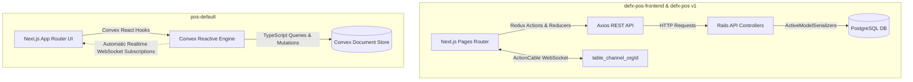
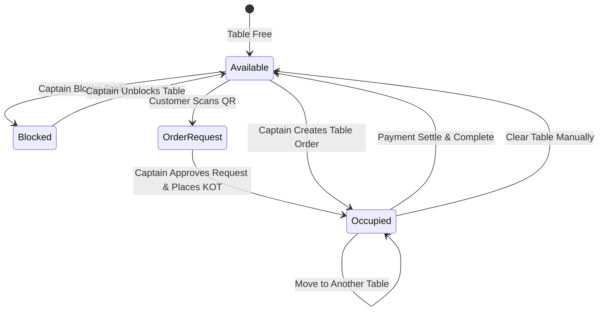

# Captain POS & Floor Management — Comprehensive Specification & Study

## 1. Executive Summary & Overview

The **Captain POS (Floor & Table Management)** system is a core operational module of the POS suite designed for floor managers, head captains, and table-side waitstaff. It bridges the physical restaurant floor layout with the kitchen display system (KDS), cashier checkout counter, and customer self-ordering QR channels.

### Primary Responsibilities
* **Floor Plan Monitoring**: Real-time visual tracking of table occupancy, seating capacities, and elapsed dining timers across multiple restaurant sections/layouts (e.g. *Indoor-DineIn*, *Patio*, *Bar Counter*).
* **Table-Side Ordering & Multi-KOT Management**: Recording dining customer details, assigning floor waitstaff, building orders, and dispatching Kitchen Order Tickets (KOT #1, KOT #2, KOT #3...) in distinct chronological batches.
* **Floor Operations & Table Transfers**: Moving active orders between tables/layouts, toggling table blockades (reservations/out-of-order), reassigning waiters, and clearing abandoned/settled tables.
* **QR Postpaid Dine-In Request Approvals**: Verifying table-side customer QR self-order scans, generating/approving 4-digit OTPs, and locking the table.
* **Pre-Check Billing & Payment Settlement**: Printing thermal guest checks, recording payments (Cash, Credit Card, Debit Card, UPI), computing cash change returns, and closing table occupancy.

---

## 2. Legacy vs. Modern Architecture Comparison



### Architectural Evolutions

| Feature Area | Legacy Rails (`defx-pos` & `defx-pos-frontend`) | Modern Convex (`pos-default`) |
|---|---|---|
| **Floor State Sync** | ActionCable WebSockets broadcasting on `table_channel_{org_id}` | Automatic reactive Convex queries (`listCaptainTables`) with zero-polling/zero-socket config. |
| **API Surface** | `CaptainTablesController`, `CaptainOrdersController`, `CaptainOrderItemsController` | Type-safe Convex mutations and queries with end-to-end TypeScript interfaces. |
| **Floor Canvas** | `react-konva` 2D HTML5 canvas rendering explicit $(X, Y)$ coordinates | Modern responsive CSS layout and flexible coordinate system. |
| **Multi-KOT Tracking** | Manual arrays of `order_items` grouped by `created_at` in Redux | Native `orderItems` queries linked to `orders` and `orderActivities`. |
| **Permission Control** | Pundit policy checking `user_type.include?('captain')` | Type-safe role verification `callerMember.userType.includes('captain')`. |

---

## 3. Floor Table State Machine & Color Specifications

Every dining table transitions through distinct operational states visually represented on the Captain floor screen:



### Visual State Matrix

| State | Status Color | Hex Code | Visual Indicator | Trigger / Condition |
|---|---|---|---|---|
| **Available** | Emerald Green | `#16a34a` / `#219653` | `🪑 Seating Capacity` | Table is vacant and ready for seating. |
| **Order Request** | Amber / Brown | `#b45309` / `#BA704F` | Pulse Animation + `Alert` | Customer scanned QR code for postpaid dine-in. |
| **In Use (Occupied)** | Sky Blue | `#0284c7` / `#006491` | `👥 Member Count` + Live Stopwatch | Active dining order with KOT sent to kitchen. |
| **Time Over 2 Hours** | Warning Amber | `#f59e0b` / `#F19C51` | `> 2hr` or `02:15:00` | Occupied table running for $> 120\text{ minutes}$. |
| **Blocked** | Danger Red | `#ef4444` / `#EB5757` | `Blocked` / `Reserved` | Table temporarily disabled for VIP or maintenance. |

---

## 4. End-to-End Workflow Stages

### Stage 1: Floor Plan & Section Selection
* Captain selects floor section (e.g. *Indoor-DineIn*, *Patio*, *Terrace*).
* Live status pills show real-time distribution: Total Tables, Available, Occupied, Requests, and Blocked.
* Tapping any table card opens the **Table Workflow Drawer**.

### Stage 2: Customer Intake & Waiter Assignment
* **Phone Number**: Customer mobile number with international dial code (+91 by default).
* **Member Count**: Total guests seated at the table.
* **Assign Waiter**: Select from configured store waiters (e.g. `1 | Johan Coder`, `3 | Rohan Rocky`).
* **Waitlist / Queue Auto-Check**: Verifies if the phone number is in today's waitlist and displays estimated wait time.
* **Customer Previous Orders Accordion**: Instant lookup of customer's previous dining history, favorite dishes, and total spend.

### Stage 3: Menu Browsing & Item Selection
* **Category Navigation**: Interactive category pills (*Snacks*, *Continental*, *Beverages*, *Desserts*).
* **Live Search**: Instant filtering by item name or SKU.
* **Item Controls**: Veg/Non-Veg indicators, price display in INR, quantity stepper (`+` / `-`).
* **"To Go" Toggle**: Marks specific items intended for takeaway packaging while dining in.
* **Modifiers / Customizations**: Modal for selecting portion sizes, spice levels, crust types, and add-ons.

### Stage 4: Running Cart & Multi-KOT Batching
* **Cart 1 (Placed KOTs)**: Lists already dispatched items with exact submission timestamps and kitchen readiness status (`✓ Food Ready`).
* **Cart 2 (Unplaced KOT)**: Holds newly selected items.
* **Dispatch KOT CTA**: Dispatches the batch to the kitchen printer/KDS station with a spinner feedback state.

### Stage 5: Payment Settlement & Bill Finalization
* **Total Payable Breakdown**: Displays net subtotal, itemized CGST/SGST/IGST taxes, discounts, and round-off totals.
* **Payment Mode Selection**: Cash, Credit Card, Debit Card, UPI.
* **Cash Tender Calculator**: Live calculation of change return (`Tender Amount - Total Bill`) with denomination shortcut chips (e.g. 5359, 5360, 5400, 6000).
* **Print Guest Receipt**: Dispatches receipt to USB/Bluetooth thermal printer.
* **Payment Received**: Finalizes order, clears table occupancy, and completes active postpaid requests.

---

## 5. Table Management & Administrative Operations

Accessible via the three-dots (`...`) menu on any table drawer:

```
[ Table 2 Options ]
├── Block / Unblock Table   --> Toggles availability without deleting table
├── Move Table              --> Transfers active order to another table/layout
├── Change Waiter           --> Updates assigned server mid-order
└── Clear Table             --> Resets table if abandoned or prematurely left
```

### 1. Move Table Workflow
1. Captain clicks **Move Table**.
2. Modal displays available vacant tables across all store layouts.
3. Upon confirmation:
   * Origin Table has `currentOrderId` cleared and flags reset.
   * Destination Table receives `currentOrderId = orderId`.
   * Order record updates `tableId = newTableId`.
   * Audit trail logs: `Moved order to Table #XX`.

### 2. Block Table Workflow
* Captain can mark a table blocked (for reservations, cleaning, or maintenance).
* Blocks dining orders on that table until explicitly unblocked.

### 3. Clear Table Workflow
* Used when customers leave without ordering or if a table was occupied by mistake.
* Clears table occupancy, resets QR request flags, and frees the table for immediate seating.

---

## 6. Convex Backend Database Schema & API Reference

### 1. Database Schema Entities

```typescript
// organizationTables
organizationTables: defineTable({
  tableNumber: v.string(),
  seatingCapacity: v.number(),
  placement: v.optional(v.string()),
  xPosition: v.optional(v.string()),
  yPosition: v.optional(v.string()),
  kidsSeatAvailability: v.optional(v.boolean()),
  disabledSeatAvailability: v.optional(v.boolean()),
  barbequeGrillAvailability: v.optional(v.boolean()),
  isBlock: v.optional(v.boolean()),
  isRequested: v.optional(v.boolean()),
  currentOrderId: v.optional(v.string()),
  layoutId: v.optional(v.id("organizationLayouts")),
  createdAt: v.number(),
  updatedAt: v.number(),
  deletedAt: v.optional(v.number()),
})
  .index("by_layout", ["layoutId"])
  .index("by_table_number", ["tableNumber"]);

// orders
orders: defineTable({
  organizationId: v.id("organizations"),
  orderNumber: v.string(),
  tokenNumber: v.string(),
  orderType: v.union(v.literal("DineIn"), v.literal("TakeAway"), v.literal("Delivery"), ...),
  orderSource: v.string(), // "Prest-Captain", "Prest-Cashier", "Prest-Online"
  orderStatusId: v.optional(v.id("organizationOrderProcesses")),
  orderStatusName: v.string(),
  isCompleted: v.boolean(),
  isRejected: v.boolean(),
  isModify: v.boolean(),
  tableId: v.optional(v.id("organizationTables")),
  waiterUserId: v.optional(v.string()),
  membersOnTable: v.optional(v.number()),
  customerName: v.optional(v.string()),
  customerPhone: v.optional(v.string()),
  subTotal: v.number(),
  taxTotal: v.number(),
  totalAmount: v.number(),
  paymentMode: v.string(),
  paymentStatus: v.union(v.literal("Pending"), v.literal("Paid"), v.literal("Failed")),
  createdAt: v.number(),
  updatedAt: v.number(),
});
```

### 2. Backend Functions Reference

| Function Name | Type | Path | Purpose |
|---|---|---|---|
| `listCaptainTables` | Query | `convex/organizationTables.ts` | Real-time floor subscription returning tables enriched with `layoutName`, `currentOrder` (items, prices, timer timestamps), and `postpaidOrderRequest`. |
| `toggleTableBlock` | Mutation | `convex/organizationTables.ts` | Toggles table `isBlock` status. |
| `clearOrder` | Mutation | `convex/organizationTables.ts` | Clears table occupancy atomically. |
| `createOrder` | Mutation | `convex/orders.ts` | Creates new table order with `orderSource: "Prest-Captain"`, locks table, logs KOT. |
| `addItemsToExistingOrder` | Mutation | `convex/orders.ts` | Appends extra KOT items to ongoing table order and recalculates totals. |
| `updateOrderItemQuantity` | Mutation | `convex/orders.ts` | Modifies item quantity or voids items. |
| `moveOrderTable` | Mutation | `convex/orders.ts` | Transfers order from Table A to Table B with atomic occupancy lock. |
| `completeOrder` | Mutation | `convex/orders.ts` | Marks order completed, creates payment entry, and frees table. |

---

## 7. Verification & Automated Test Suite

All Captain domain functions are covered by automated unit & integration tests:

* [`convex/organizationTables.test.ts`](file:///c:/Workspace/pos-default/convex/organizationTables.test.ts) (15 Tests):
  * Table creation with explicit & automatic grid coordinates.
  * Role authorization (Admin, Cashier, Captain access permitted; Waiter rejected).
  * Unique table number validation scoped to layouts.
  * Table block toggle and atomic order clear.
  * `listCaptainTables` query enrichment.
* [`convex/orders.test.ts`](file:///c:/Workspace/pos-default/convex/orders.test.ts) (7 Tests):
  * Order creation with `orderSource: "Prest-Captain"` and table locking.
  * Appending items via `addItemsToExistingOrder`.
  * Adjusting item quantities and financial recalculation.
  * Transferring orders between tables via `moveOrderTable`.

---

## 8. Directory & Source Code Mapping

| Component | Path | Description |
|---|---|---|
| **Captain POS Page** | [`app/captain/page.tsx`](file:///c:/Workspace/pos-default/app/captain/page.tsx) | Interactive Next.js floor screen, drawer, menu, and payment UI. |
| **Tables API** | [`convex/organizationTables.ts`](file:///c:/Workspace/pos-default/convex/organizationTables.ts) | Table queries, mutations, layout assignments, and block toggles. |
| **Orders API** | [`convex/orders.ts`](file:///c:/Workspace/pos-default/convex/orders.ts) | Order lifecycle, KOT appending, table moves, and bill payments. |
| **Waiters API** | [`convex/organizationWaiters.ts`](file:///c:/Workspace/pos-default/convex/organizationWaiters.ts) | Waiter staff directory and assignments. |
| **Postpaid QR API** | [`convex/postpaidOrderRequests.ts`](file:///c:/Workspace/pos-default/convex/postpaidOrderRequests.ts) | QR table self-order requests and OTP approvals. |
