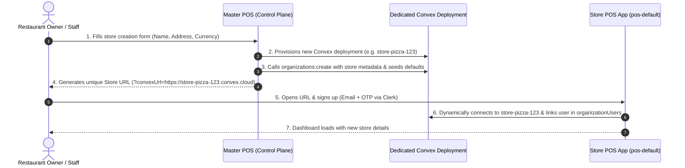

# Organization Authentication, Provisioning & Multi-Tenant Architecture Flow

This document details the complete authentication, multi-restaurant provisioning, database structure, and store connection flow for the POS system.

---

## 1. Architecture Overview

The POS platform is split into two major layers:

```
┌──────────────────────────────────────────────────────────────────┐
│                   Master POS (Control Plane)                     │
│  - Merchant account management                                   │
│  - Restaurant onboarding & store creation forms                  │
│  - Provisions dedicated Convex database deployments per store    │
└─────────────────────────────────┬────────────────────────────────┘
                                  │ Provisions store & generates link
                                  ▼
┌──────────────────────────────────────────────────────────────────┐
│                   Store POS (pos-default App)                    │
│  - Individual store operational UI (POS, KDS, Inventory, Orders) │
│  - Runs against dedicated store Convex deployment                │
│  - User authentication via Clerk (with Convex JWT integration)   │
└──────────────────────────────────────────────────────────────────┘
```

---

## 2. End-to-End Workflow: From Store Creation to Dashboard



---

## 3. Step-by-Step Flow Breakdown

### Step 1: Restaurant Provisioning from Master POS
1. A restaurant owner/merchant registers on the **Master POS** portal and creates a restaurant (e.g. `"My Pizza Palace"`).
2. The Master POS uses the Convex Management API to provision a dedicated Convex database deployment.
3. Master POS generates a secure HMAC SHA-256 token using `PROVISIONING_SECRET` and calls `organizations:create` in the newly provisioned deployment to:
   * Insert the store entity (`name: "My Pizza Palace"`, `slug: "my-pizza-palace"`, tax settings, currency).
   * Seed default payment modes (Cash, Cards, UPI).
   * Seed default inventory categories and order process states.
   * Initialize standard feature flags.

### Step 2: Unique Store Access URL
Master POS provides the merchant with their direct Store POS URL:
```
https://pos.yourdomain.com/?convexUrl=https://store-pizza-123.convex.cloud
```

### Step 3: User Signup / Login via Clerk
1. The merchant or staff member opens the Store POS link.
2. The Next.js middleware (`proxy.ts`) checks authentication:
   * If unauthenticated, redirects to `/sign-in` or `/sign-up`.
3. The user registers via Clerk using **Email + OTP / Password** on `/sign-up`.
4. Clerk creates the user profile and assigns a Clerk User ID (e.g., `user_3IDPsiZP...`).

### Step 4: Dynamic Convex Connection
1. In `app/ConvexClientProvider.tsx`:
   * If `?convexUrl=...` is in the URL, `ConvexReactClient` dynamically connects to that specific store's Convex deployment.
   * If no `convexUrl` parameter is supplied in the URL, it falls back to the default `NEXT_PUBLIC_CONVEX_URL` configured in `.env.local`.
2. `ConvexProviderWithClerk` attaches Clerk's session JWT to Convex API requests.

### Step 5: Store Owner Linking & Role Assignment
1. When the authenticated user accesses the store:
   * Convex matches the Clerk User ID (`identity.subject`).
   * If the store is unowned or belongs to the user, Convex sets `ownerClerkId` on the `organizations` document.
   * A membership record is created in the `organizationUsers` table:
     * `organizationId`: Store ID
     * `userId`: Clerk User ID
     * `userType`: `["admin"]`
     * `userPermission`: Full CRUD permissions.

### Step 6: Dashboard Entry
The user arrives on `/dashboard` with full access to their restaurant's live metrics, active orders, inventory, kitchen displays, and organization configuration.

---

## 4. Database Schema & Tables

| Table Name | Description | Key Fields |
| :--- | :--- | :--- |
| **`organizations`** | Core restaurant store entity and configurations | `name`, `slug`, `legalEntityName`, `ownerClerkId`, `isDineIn`, `isTakeAway`, `isDelivery`, `isGst`, `isFssai`, `operationTiming` |
| **`organizationUsers`** | Staff and user memberships & permissions | `organizationId`, `userId` (Clerk User ID), `userType` (`["admin"]`, `["cashier"]`, `["waiter"]`, `["chef"]`), `userPermission` |
| **`organizationFeatures`** | Per-store feature flags & toggles | `organizationId`, `featureKey`, `active` |
| **`paymentModes`** | Enabled payment options | `organizationId`, `name` (Cash, Card, UPI), `active` |
| **`inventoryCategories`** | Stock & inventory categories | `organizationId`, `name` |
| **`organizationLayouts`** | Table seating layouts (e.g., Indoor-DineIn) | `organizationId`, `name` |
| **`organizationOrderProcesses`** | Order lifecycle states | `name` (Accepted, In Progress, Ready, Delivered), `position` |

---

## 5. Where to Check Entries

1. **Clerk Dashboard (`dashboard.clerk.com`)**:
   * View registered user accounts, emails, and Clerk User IDs under **Users**.
2. **Convex Dashboard (`npx convex dashboard`)**:
   * Inspect the `organizations` table for store metadata and `ownerClerkId`.
   * Inspect the `organizationUsers` table for user role mappings (`userType: ["admin"]`).
3. **In-App Management (`http://localhost:3000/organization`)**:
   * View live Core Info, Operational Flags, Current Membership status, and Active Staff members.
