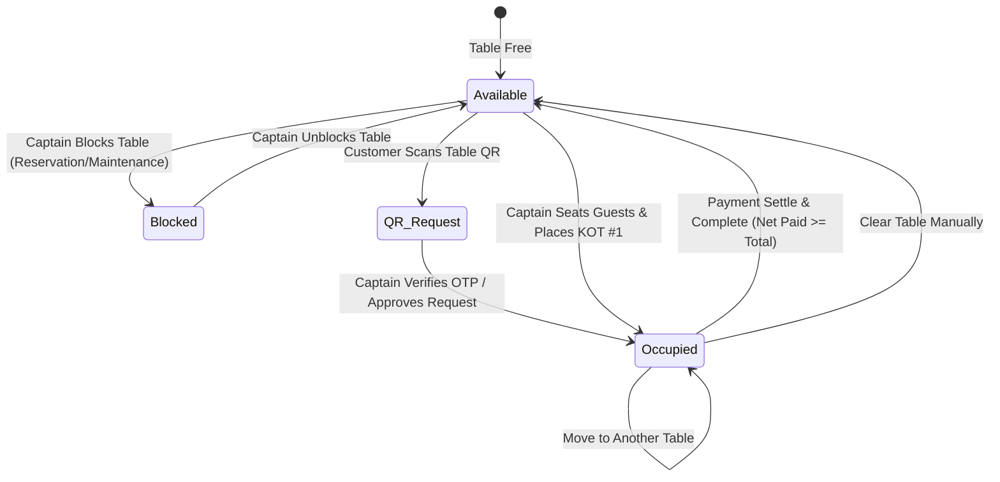

# Captain POS & Floor Management Study and Architecture

## 1. Executive Summary

The **Captain POS (Floor & Table Management)** module is the core operational interface in the POS ecosystem used by Restaurant Floor Managers, Head Captains, and Waitstaff. It connects table-side dining operations, real-time kitchen preparation (KDS/KOT), customer QR self-order channels, and cashier counter billing into a single synchronized system.

This document compiles the complete technical specification, system mappings, data models, state machines, and detailed documentation of recent feature enhancements implemented on the Captain screen (`app/captain/page.tsx`) and Convex backend (`convex/orders.ts`, `convex/schema.ts`).

---

## 2. Legacy vs. Modern System Mapping

### 2.1 Backend Route to Convex Function Mapping

| Legacy Rails Endpoint (`defx-pos` v1) | Controller / Action | Modern Convex Function (`pos-default`) | Purpose |
|---|---|---|---|
| `GET /api/v1/captain_tables` | `CaptainTablesController#index` | `api.organizationTables.listCaptainTables` | Real-time floor subscription returning tables with live `currentOrder`, active `postpaidOrderRequest`, and layout metadata. |
| `POST /api/v1/captain_tables/update_position` | `CaptainTablesController#update_position` | `api.organizationTables.updateTable` | Updates table $(X, Y)$ canvas coordinates and placement properties. |
| `POST /api/v1/captain_tables/toggle_block` | `CaptainTablesController#toggle_block` | `api.organizationTables.toggleTableBlock` | Toggles table blocked status (`isBlock`) for reservations/maintenance. |
| `POST /api/v1/captain_tables/clear_order` | `CaptainTablesController#clear_order` | `api.organizationTables.clearOrder` | Atomically frees an abandoned or occupied table. |
| `POST /api/v1/captain_orders` | `CaptainOrdersController#create` | `api.orders.createOrder` | Creates table dining order with `orderSource: "Prest-Captain"`, locks table, logs KOT #1 with item-level `isToGo` flags. |
| `POST /api/v1/captain_orders/add_items` | `CaptainOrderItemsController#create` | `api.orders.addItemsToExistingOrder` | Appends subsequent KOT batches (KOT #2, KOT #3) to an active table order with item-level `isToGo` flags and recalculates subtotals/taxes. |
| `PUT /api/v1/captain_orders/update_item` | `CaptainOrderItemsController#update` | `api.orders.updateOrderItemQuantity` | Modifies item quantity or voids items with financial recalculation. |
| `POST /api/v1/captain_orders/move_table` | `CaptainOrdersController#move_table` | `api.orders.moveOrderTable` | Transfers active order from Table A to Table B with atomic occupancy handoff. |
| `POST /api/v1/captain_orders/settle_payment` | `CaptainOrdersController#settle` | `api.orders.completeOrder` / `api.orders.recordPayment` | Finalizes order using net paid balance calculations, creates payment transaction, and frees table occupancy. |
| `GET /api/v1/menus/get_organization_menu` | `MenusController#get_organization_menu` | `api.menu.getOrganizationMenu` | Fetches active categories, subcategories, and menu items with dietary flags and pricing. |
| `GET /api/v1/waiters` | `WaitersController#index` | `api.organizationWaiters.list` | Returns active store waitstaff directory. |
| `GET /api/v1/customers/stats` | `CustomersController#stats` | `api.orders.getCustomerStats` | Fetches customer dining statistics, lifetime spend, and past order history. |

---

## 3. Floor Table State Machine & Color Specifications



### Table Status Color Reference

| Status | Color Name | Hex Code | Visual Badge / Info | Condition / Trigger |
|---|---|---|---|---|
| **Available** | Emerald Green | `#16a34a` / `#219653` | `🪑 Seating Capacity` | Table is vacant and ready for seating. |
| **Order Request** | Amber / Brown | `#b45309` / `#BA704F` | Pulse Animation + `Alert` | Customer scanned QR code for postpaid dine-in self-ordering. |
| **In-Use (Occupied)** | Sky Blue | `#0284c7` / `#006491` | `👥 Guests` + Running Stopwatch | Table has an active dining order with KOT sent to kitchen. |
| **Time Over 2 Hours** | Warning Amber | `#f59e0b` / `#F19C51` | `> 2hr` or `02:15:00` | Occupied table has been seated for $> 120\text{ minutes}$. |
| **Blocked** | Danger Red | `#ef4444` / `#EB5757` | `Blocked` / `Reserved` (White Text) | Table temporarily disabled for VIP reservation or cleaning. |

---

## 4. End-to-End Operational Workflows & Recent Enhancements

### 4.1 Table Seating & Customer Intake with Insights
1. Floor Captain taps an **Available** (green) table card on the floor screen.
2. The **Table Drawer** opens displaying customer intake:
   * **Phone Number**: Customer mobile number with country code selection (+91 default).
   * **Guest Count (`membersOnTable`)**: Number of seated diners.
   * **Assign Waiter**: Select from configured store waitstaff directory.
   * **Waitlist / Queue Check**: Automatically verifies if the phone number is on today's waiting list.
   * **Customer Insights & History**: Integrated via `api.orders.getCustomerStats`. Displays:
     * Lifetime visits (split into Dine-in and Takeaway counts).
     * Total lifetime expenditure formatted in active store currency.
     * **Previous Orders Modal**: View past orders, item breakdown, order dates, and quick re-order capability (matching Cashier screen).

### 4.2 Item-Level "To Go" (Takeaway Flag) & Menu Ordering
1. **Catalog Ordering Grid**: Standardized ordering table layout with explicit columns:
   $$\text{Quantity} \quad | \quad \text{To go} \quad | \quad \text{Item} \quad | \quad \text{Price}$$
2. **Item-Level Takeaway Flag (`isToGo`)**:
   * Captains can check individual items as **"To Go"** directly in the ordering table while dining in.
   * Tooltip guidance provided: *"Togo is used when you want the food for to go while dining"*.
   * Stored per order line item in Convex schema (`orderItems.isToGo`).
   * Placed active items display a prominent `🛍️ To go` badge under Cart 1.
   * Redundant global `To go` checkbox removed from Cart 2 summary box.
3. **Multi-KOT Dispatch**:
   * Pending items build up in Cart 2.
   * Tapping **"Place Order"** invokes `api.orders.createOrder` or `api.orders.addItemsToExistingOrder`.
   * Items transition into Cart 1 with timestamp and preparation tracking.

### 4.3 Mid-Order Floor Operations (3-Dots Menu)
* **Move Table**: Select a destination table across any floor section. Atomically transfers the order, reassigns `currentOrderId`, and logs an audit trail.
* **Block / Unblock Table**: Toggles table availability. Unblock button explicitly styled in high-contrast white text (`text-white font-bold`).
* **Clear Table**: Clears table occupancy if diners leave prematurely or an order was opened by mistake.
* **Quantity Modification / Voids**: Adjust item counts or void items with real-time tax/subtotal recalculation.

### 4.4 Payment Settlement & Net Paid Balance Logic
1. **Financial Recalculation (`netPaid`)**:
   * Payment status evaluation in `convex/orders.ts` (`recordPayment` & `get` query) computes:
     $$\text{netPaid} = \text{totalCredit} - \text{totalDebit}$$
   * When an order is re-paid after a refund, once $\text{netPaid} \ge \text{totalAmount}$, payment status transitions to `"Paid"` and order status automatically restores to `"Accepted"` (preventing orders from getting stuck in `"Cancelled / Refunded"` status).
2. **Simplified Payment Flow**:
   * Support for **Cash**, **Credit Card**, **Debit Card**, and **UPI**.
   * Removed legacy `Auth / Approval Code` requirement for Card/UPI payments on Captain screen for rapid cashiering.
   * Cash tender calculations show exact denomination shortcuts and **Change Due**.
3. **Table Release**: Tapping **"Payment Received"** completes the order and automatically sets `currentOrderId = undefined`, returning the table to **Available** status.

### 4.5 Design & Typography Standardization
* **Font Family Alignment**: Replaced legacy `font-garamond` with modern, clean `font-sans font-bold` hierarchy matching the Cashier POS screen.
* **Copy Simplification**: Removed confusing "KOT" text labels from UI headers (`Cart 1`, `Cart 2`), presenting clean order summaries to waitstaff.

---

## 5. Convex Database Schema Reference

```typescript
// organizationTables
organizationTables: defineTable({
  tableNumber: v.string(),
  seatingCapacity: v.number(),
  placement: v.optional(v.string()),
  xPosition: v.optional(v.string()),
  yPosition: v.optional(v.string()),
  kidsSeatAvailability: v.optional(v.boolean()),
  disabledSeatAvailability: v.optional(v.boolean()),
  barbequeGrillAvailability: v.optional(v.boolean()),
  isBlock: v.optional(v.boolean()),
  isRequested: v.optional(v.boolean()),
  currentOrderId: v.optional(v.string()),
  layoutId: v.optional(v.id("organizationLayouts")),
  createdAt: v.number(),
  updatedAt: v.number(),
  deletedAt: v.optional(v.number()),
})
  .index("by_layout", ["layoutId"])
  .index("by_table_number", ["tableNumber"]);

// orders (DineIn / Prest-Captain)
orders: defineTable({
  organizationId: v.id("organizations"),
  orderNumber: v.string(),
  tokenNumber: v.string(),
  orderType: v.union(v.literal("DineIn"), v.literal("TakeAway"), v.literal("Delivery"), ...),
  orderSource: v.string(), // "Prest-Captain" | "Prest-Cashier" | "Prest-Online"
  orderStatusId: v.optional(v.id("organizationOrderProcesses")),
  orderStatusName: v.string(),
  isCompleted: v.boolean(),
  isRejected: v.boolean(),
  isModify: v.boolean(),
  tableId: v.optional(v.id("organizationTables")),
  waiterUserId: v.optional(v.string()),
  membersOnTable: v.optional(v.number()),
  customerName: v.optional(v.string()),
  customerPhone: v.optional(v.string()),
  subTotal: v.number(),
  taxTotal: v.number(),
  totalAmount: v.number(),
  paymentMode: v.string(),
  paymentStatus: v.union(v.literal("Pending"), v.literal("Paid"), v.literal("Failed")),
  createdAt: v.number(),
  updatedAt: v.number(),
});

// orderItems (Item-level takeaway support)
orderItems: defineTable({
  orderId: v.id("orders"),
  organizationId: v.id("organizations"),
  menuItemId: v.id("organizationMenuItems"),
  quantity: v.number(),
  unitPrice: v.number(),
  totalPrice: v.number(),
  isToGo: v.optional(v.boolean()), // Flag for item-level takeaway packaging
  createdAt: v.number(),
  updatedAt: v.number(),
}).index("by_order", ["orderId"]);
```

---

## 6. Codebase Verification & Test Coverage

| Test File | Total Tests | Status | Key Coverage |
|---|---|---|---|
| [`convex/organizationTables.test.ts`](file:///c:/Workspace/pos-default/convex/organizationTables.test.ts) | 15 | Passed (100%) | Layout assignment, Captain/Admin/Cashier role authorization, block toggle, atomic clear, grid coordinate calculation, table enrichment. |
| [`convex/orders.test.ts`](file:///c:/Workspace/pos-default/convex/orders.test.ts) | 7 | Passed (100%) | Order creation with `Prest-Captain` source, table locking, adding KOT items with `isToGo`, updating item quantities, moving orders between tables, net balance payment recalculations. |
| **TypeScript Compilation** (`npx tsc --noEmit`) | - | 0 Errors | Full strict typing across Convex backend and Next.js frontend. |

---

## 7. File & Component Index

* **Frontend Floor & Captain UI**: [`app/captain/page.tsx`](file:///c:/Workspace/pos-default/app/captain/page.tsx)
* **Tables Backend**: [`convex/organizationTables.ts`](file:///c:/Workspace/pos-default/convex/organizationTables.ts)
* **Orders & Multi-KOT Backend**: [`convex/orders.ts`](file:///c:/Workspace/pos-default/convex/orders.ts)
* **Schema Definitions**: [`convex/schema.ts`](file:///c:/Workspace/pos-default/convex/schema.ts)
* **Waitstaff Backend**: [`convex/organizationWaiters.ts`](file:///c:/Workspace/pos-default/convex/organizationWaiters.ts)
* **Postpaid QR Backend**: [`convex/postpaidOrderRequests.ts`](file:///c:/Workspace/pos-default/convex/postpaidOrderRequests.ts)
* **Captain Floor Management Spec**: [`docs/CAPTAIN_POS_FLOOR_MANAGEMENT_SPEC.md`](file:///c:/Workspace/pos-default/docs/CAPTAIN_POS_FLOOR_MANAGEMENT_SPEC.md)

