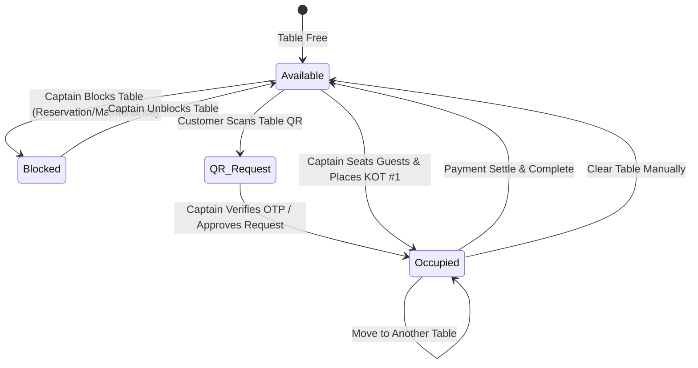

# Captain POS & Floor Management Study and Architecture

## 1. Executive Summary

The **Captain POS (Floor & Table Management)** module is the core operational interface in the POS ecosystem used by Restaurant Floor Managers, Head Captains, and Waitstaff. It connects table-side dining operations, real-time kitchen preparation (KDS/KOT), customer QR self-order channels, and cashier counter billing into a single synchronized system.

This document compiles the complete study of:
1. **Legacy Systems**: `defx-pos-frontend` (Next.js Pages Router + Redux + ActionCable) and `defx-pos` v1 (Ruby on Rails + PostgreSQL).
2. **Designer Mockup Evaluation**: UI/UX analysis of the new mockup and 7 critical gap solutions.
3. **Modern Architecture**: Convex reactive backend (`pos-default`) + Next.js App Router (`app/captain/page.tsx`).
4. **Data Models, State Machines, & End-to-End Workflows**.

---

## 2. Legacy vs. Modern System Mapping

### 2.1 Backend Route to Convex Function Mapping

| Legacy Rails Endpoint (`defx-pos` v1) | Controller / Action | Modern Convex Function (`pos-default`) | Purpose |
|---|---|---|---|
| `GET /api/v1/captain_tables` | `CaptainTablesController#index` | `api.organizationTables.listCaptainTables` | Real-time floor subscription returning tables with live `currentOrder`, active `postpaidOrderRequest`, and layout metadata. |
| `POST /api/v1/captain_tables/update_position` | `CaptainTablesController#update_position` | `api.organizationTables.updateTable` | Updates table $(X, Y)$ canvas coordinates and placement properties. |
| `POST /api/v1/captain_tables/toggle_block` | `CaptainTablesController#toggle_block` | `api.organizationTables.toggleTableBlock` | Toggles table blocked status (`isBlock`) for reservations/maintenance. |
| `POST /api/v1/captain_tables/clear_order` | `CaptainTablesController#clear_order` | `api.organizationTables.clearOrder` | Atomically frees an abandoned or occupied table. |
| `POST /api/v1/captain_orders` | `CaptainOrdersController#create` | `api.orders.createOrder` | Creates table dining order with `orderSource: "Prest-Captain"`, locks table, logs KOT #1. |
| `POST /api/v1/captain_orders/add_items` | `CaptainOrderItemsController#create` | `api.orders.addItemsToExistingOrder` | Appends subsequent KOT batches (KOT #2, KOT #3) to an active table order and recalculates subtotals/taxes. |
| `PUT /api/v1/captain_orders/update_item` | `CaptainOrderItemsController#update` | `api.orders.updateOrderItemQuantity` | Modifies item quantity or voids items with financial recalculation. |
| `POST /api/v1/captain_orders/move_table` | `CaptainOrdersController#move_table` | `api.orders.moveOrderTable` | Transfers active order from Table A to Table B with atomic occupancy handoff. |
| `POST /api/v1/captain_orders/settle_payment` | `CaptainOrdersController#settle` | `api.orders.completeOrder` | Finalizes order, creates payment transaction, and frees table occupancy. |
| `GET /api/v1/menus/get_organization_menu` | `MenusController#get_organization_menu` | `api.menu.getOrganizationMenu` | Fetches active categories, subcategories, and menu items with dietary flags and pricing. |
| `GET /api/v1/waiters` | `WaitersController#index` | `api.organizationWaiters.list` | Returns active store waitstaff directory. |

---

## 3. Floor Table State Machine & Color Specifications



### Table Status Color Reference

| Status | Color Name | Hex Code | Visual Badge / Info | Condition / Trigger |
|---|---|---|---|---|
| **Available** | Emerald Green | `#16a34a` / `#219653` | `🪑 Seating Capacity` | Table is vacant and ready for seating. |
| **Order Request** | Amber / Brown | `#b45309` / `#BA704F` | Pulse Animation + `Alert` | Customer scanned QR code for postpaid dine-in self-ordering. |
| **In-Use (Occupied)** | Sky Blue | `#0284c7` / `#006491` | `👥 Guests` + Running Stopwatch | Table has an active dining order with KOT sent to kitchen. |
| **Time Over 2 Hours** | Warning Amber | `#f59e0b` / `#F19C51` | `> 2hr` or `02:15:00` | Occupied table has been seated for $> 120\text{ minutes}$. |
| **Blocked** | Danger Red | `#ef4444` / `#EB5757` | `Blocked` / `Reserved` | Table temporarily disabled for VIP reservation or cleaning. |

---

## 4. End-to-End Operational Workflows

### 4.1 Table Seating & Customer Intake
1. Floor Captain taps an **Available** (green) table card on the floor screen.
2. The **Table Drawer** opens displaying customer intake:
   * **Phone Number**: Customer mobile number with country code (+91 default).
   * **Guest Count (`membersOnTable`)**: Number of seated diners.
   * **Assign Waiter**: Select from configured store waitstaff (e.g. `1 | Johan Coder`).
   * **Waitlist / Queue Check**: Automatically verifies if the phone number is on today's waiting list.
   * **Order History**: Instant lookup of past dining history, favorite dishes, and spend.

### 4.2 Menu Ordering & Multi-KOT Dispatch
1. Captain navigates menu categories (*Snacks*, *Continental*, *Beverages*, *Desserts*).
2. Items can be searched by name or SKU, with veg/non-veg dietary indicators.
3. Item quantities are adjusted via `+` / `-` steppers. Individual items can be flagged as **"To Go"** for takeaway packaging.
4. **Cart 2 (Unplaced KOT)** holds pending items.
5. Tapping **"Dispatch KOT"** calls `api.orders.createOrder` (for new tables) or `api.orders.addItemsToExistingOrder` (for running tables).
6. Items transition into **Cart 1 (Placed KOTs)** with timestamp and kitchen readiness indicators (`✓ Food Ready`).

### 4.3 Mid-Order Floor Operations (3-Dots Menu)
* **Move Table**: Select a destination table across any floor section. Atomically transfers the order, reassigns `currentOrderId`, and logs an audit trail.
* **Block / Unblock Table**: Toggles table availability without deleting layout data.
* **Clear Table**: Clears table occupancy if diners leave prematurely or an order was opened by mistake.
* **Quantity Modification / Voids**: Adjust item counts or void items with real-time tax/subtotal recalculation.

### 4.4 Payment Settlement & Cash Tender Calculation
1. Captain or Cashier views itemized subtotal, applicable taxes (CGST/SGST/IGST), discounts, and total payable amount.
2. Select payment method: **Cash**, **Credit Card**, **Debit Card**, or **UPI**.
3. For cash payments, the system provides denomination shortcut chips (e.g. 5359, 5360, 5400, 6000) and displays exact **Change Due** in real time.
4. Tapping **"Payment Received"** executes `api.orders.completeOrder`:
   * Creates a recorded payment transaction.
   * Marks the order as completed.
   * Clears table occupancy (`currentOrderId = undefined`).
   * Frees the table back to **Available** status.

---

## 5. Convex Database Schema Reference

```typescript
// organizationTables
organizationTables: defineTable({
  tableNumber: v.string(),
  seatingCapacity: v.number(),
  placement: v.optional(v.string()),
  xPosition: v.optional(v.string()),
  yPosition: v.optional(v.string()),
  kidsSeatAvailability: v.optional(v.boolean()),
  disabledSeatAvailability: v.optional(v.boolean()),
  barbequeGrillAvailability: v.optional(v.boolean()),
  isBlock: v.optional(v.boolean()),
  isRequested: v.optional(v.boolean()),
  currentOrderId: v.optional(v.string()),
  layoutId: v.optional(v.id("organizationLayouts")),
  createdAt: v.number(),
  updatedAt: v.number(),
  deletedAt: v.optional(v.number()),
})
  .index("by_layout", ["layoutId"])
  .index("by_table_number", ["tableNumber"]);

// orders (DineIn / Prest-Captain)
orders: defineTable({
  organizationId: v.id("organizations"),
  orderNumber: v.string(),
  tokenNumber: v.string(),
  orderType: v.union(v.literal("DineIn"), v.literal("TakeAway"), v.literal("Delivery"), ...),
  orderSource: v.string(), // "Prest-Captain" | "Prest-Cashier" | "Prest-Online"
  orderStatusId: v.optional(v.id("organizationOrderProcesses")),
  orderStatusName: v.string(),
  isCompleted: v.boolean(),
  isRejected: v.boolean(),
  isModify: v.boolean(),
  tableId: v.optional(v.id("organizationTables")),
  waiterUserId: v.optional(v.string()),
  membersOnTable: v.optional(v.number()),
  customerName: v.optional(v.string()),
  customerPhone: v.optional(v.string()),
  subTotal: v.number(),
  taxTotal: v.number(),
  totalAmount: v.number(),
  paymentMode: v.string(),
  paymentStatus: v.union(v.literal("Pending"), v.literal("Paid"), v.literal("Failed")),
  createdAt: v.number(),
  updatedAt: v.number(),
});
```

---

## 6. Codebase Verification & Test Coverage

| Test File | Total Tests | Status | Key Coverage |
|---|---|---|---|
| [`convex/organizationTables.test.ts`](file:///c:/Workspace/pos-default/convex/organizationTables.test.ts) | 15 | Passed (100%) | Layout assignment, Captain/Admin/Cashier role authorization, block toggle, atomic clear, grid coordinate calculation, table enrichment. |
| [`convex/orders.test.ts`](file:///c:/Workspace/pos-default/convex/orders.test.ts) | 7 | Passed (100%) | Order creation with `Prest-Captain` source, table locking, adding KOT items, updating item quantities, moving orders between tables. |
| **TypeScript Compilation** (`tsc --noEmit`) | - | 0 Errors | Full strict typing across Convex backend and Next.js frontend. |

---

## 7. File & Component Index

* **Frontend Floor & Drawer UI**: [`app/captain/page.tsx`](file:///c:/Workspace/pos-default/app/captain/page.tsx)
* **Tables Backend**: [`convex/organizationTables.ts`](file:///c:/Workspace/pos-default/convex/organizationTables.ts)
* **Orders & Multi-KOT Backend**: [`convex/orders.ts`](file:///c:/Workspace/pos-default/convex/orders.ts)
* **Waitstaff Backend**: [`convex/organizationWaiters.ts`](file:///c:/Workspace/pos-default/convex/organizationWaiters.ts)
* **Postpaid QR Backend**: [`convex/postpaidOrderRequests.ts`](file:///c:/Workspace/pos-default/convex/postpaidOrderRequests.ts)
* **Design Spec**: [`docs/CAPTAIN_POS_FLOOR_MANAGEMENT_SPEC.md`](file:///c:/Workspace/pos-default/docs/CAPTAIN_POS_FLOOR_MANAGEMENT_SPEC.md)
