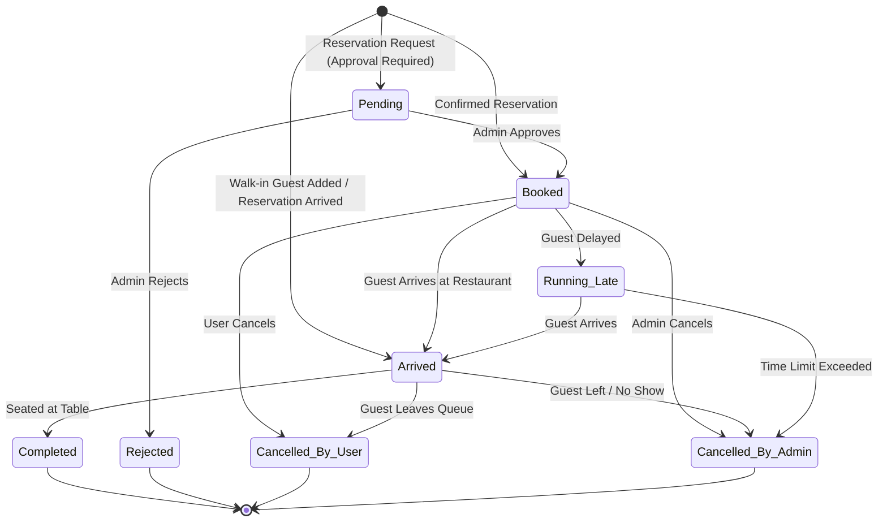

# Queue & Reservation System Specification

This document provides a comprehensive technical and UI/UX design reference for the **Queue & Reservation Management System** in the POS & Storefront platform. It details all database schemas, data types, business logic, status lifecycles, and user interface requirements to guide UI/UX design and development.

---

## 1. Overview & System Purpose

The Queue & Reservation system handles:
1. **Walk-in Waitlists (Live Queuing)**: Enables hosts/cashiers to add walk-in guests, assign daily ticket numbers, track wait times, and seat parties at assigned tables.
2. **Advance Table Reservations**: Allows customers to reserve tables in advance for specific dates and time slots.
3. **Online Customer Queue (Storefront / QR)**: Enables guests to scan a QR code or use the storefront to view waitlist status, check real-time queue position, or request a queue position within geo-fenced boundaries.
4. **Queue Audit Logging**: Complete activity history tracking for state changes, table assignments, and cancellations.

---

## 2. User Roles & Personas

| Persona | Primary Goal | Key UI Interactions |
| :--- | :--- | :--- |
| **Cashier / Host** | Manage live flow of restaurant walk-ins and reservations | View live waitlist cards, call next party, assign table, mark seated/no-show/cancelled. |
| **Store Manager / Admin** | Configure queue operating rules and business constraints | Define waitlist/reservation hours, max party size, slot durations, auto-approval rules, and geo-fencing. |
| **Customer (Storefront/QR)** | Join queue, view status, or reserve table | View live position in queue ("3 parties ahead"), get estimated wait time, request reservation, cancel ticket. |

---

## 3. Database Schema & Data Dictionary

### Table 1: `organizationQueues`
Stores individual queue tickets for both walk-in waitlists and advance reservations.

| Field Name | Type | Required / Optional | Allowed Values / Format | Description |
| :--- | :--- | :--- | :--- | :--- |
| `_id` | `Id<"organizationQueues">` | System Generated | Unique ID | Primary key for queue entry |
| `queueType` | `string` (enum) | **Required** | `"waitlist"`, `"reservation"`, `"waitlist_off"`, `"reservation_off"` | Type of queue entry |
| `queueStatus` | `string` (enum) | **Required** | `"booked"`, `"pending"`, `"arrived"`, `"running_late"`, `"completed"`, `"rejected"`, `"close"`, `"cancelled_by_user"`, `"cancelled_by_admin"` | Current lifecycle status |
| `queueNumber` | `string` | Optional | e.g. `"30-09-2026.QN001"`, `"30-09-2026.RN001"` | Daily sequential ticket number (`QN` = Waitlist, `RN` = Reservation) |
| `totalGuests` | `number` | Optional | Integer (e.g. `4`) | Number of guests/party size |
| `kidsSeat` | `boolean` | Optional | `true` / `false` | Special seating request: High chairs / kids seat needed |
| `disabledSeat` | `boolean` | Optional | `true` / `false` | Special seating request: Wheelchair / accessible seating needed |
| `barbequeSeat` | `boolean` | Optional | `true` / `false` | Special seating request: Barbeque / live cooking table needed |
| `reservationDate` | `string` | Optional | `"YYYY-MM-DD"` (e.g. `"2026-09-30"`) | Scheduled date for reservation or waitlist entry |
| `reservationTime` | `number` | Optional | Timestamp (ms) | Scheduled time for reservation |
| `notes` | `string` | Optional | Text | Customer notes or special instructions |
| `reason` | `string` | Optional | Text | Reason for cancellation or rejection |
| `layoutId` | `Id<"organizationLayouts">`| Optional | Floor plan layout reference | Assigned floor layout |
| `tableId` | `Id<"organizationTables">` | Optional | Table reference | Assigned table for party |
| `orderId` | `string` | Optional | Order ID | Associated POS order ID if guest started ordering |
| `userId` | `string` | Optional | User ID | Registered customer user ID |
| `cancellationTime` | `number` | Optional | Timestamp (ms) | Time ticket was cancelled |
| `completionTime` | `number` | Optional | Timestamp (ms) | Time party was seated / completed |
| `createdAt` | `number` | **Required** | Timestamp (ms) | Entry creation timestamp |
| `updatedAt` | `number` | **Required** | Timestamp (ms) | Last updated timestamp |

---

### Table 2: `organizationQueueConfigurations`
Store-level configuration settings governing queue operations.

| Field Name | Type | Required / Optional | Default Value / Structure | Description |
| :--- | :--- | :--- | :--- | :--- |
| `_id` | `Id<"organizationQueueConfigurations">` | System Generated | Unique ID | Primary key for store configuration |
| `onlineWaitlist` | `boolean` | Optional | `true` / `false` | Enable/disable online waitlist for guests |
| `onlineReservation` | `boolean` | Optional | `true` / `false` | Enable/disable online table reservations |
| `customerViewWaitlist` | `boolean` | Optional | `true` / `false` | Allow guests to view live waitlist position online |
| `bookingApproval` | `boolean` | Optional | `true` / `false` | Require admin approval for online reservation requests |
| `defaultWaitTime` | `string` | Optional | e.g. `"15"` (minutes) | Default estimated wait time per party/guest |
| `defaultPartySize` | `number` | Optional | e.g. `2` | Default party size pre-filled in forms |
| `waitlistHours` | `WeeklySchedule` | Optional | JSON Weekly Schedule | Operating hours window for joining waitlists |
| `reservationHours` | `WeeklySchedule` | Optional | JSON Weekly Schedule | Operating hours window for making reservations |
| `geoFence` | `boolean` | Optional | `true` / `false` | Require customer to be within physical distance to join queue |
| `geoFenceRadius` | `string` | Optional | e.g. `"500"` (meters) | Radius in meters allowed for geo-fencing |
| `geoFenceLatitude` | `number` | Optional | Decimal (e.g. `12.9716`) | Store latitude coordinates |
| `geoFenceLongitude` | `number` | Optional | Decimal (e.g. `77.5946`) | Store longitude coordinates |
| `maxBookingPerCustomer` | `string` | Optional | e.g. `"2"` | Max active bookings a single customer can create |
| `maxBookingPerCustomerTime` | `string` | Optional | e.g. `"24"` (hours) | Timeframe limit for max customer bookings |
| `reservationSlotSize` | `string` | Optional | e.g. `"30"` (minutes) | Interval duration for reservation slots |
| `reservationPerTimeSlot` | `string` | Optional | e.g. `"5"` | Max allowed reservations per slot |
| `queueTimeFormat` | `string` | Optional | `"12h"` or `"24h"` | Time format for displaying queue timestamps |

#### Weekly Schedule JSON Structure (`waitlistHours` / `reservationHours`)
```json
{
  "Monday": {
    "is_open": true,
    "hours": [
      { "start_time": "11:00 AM", "end_time": "11:00 PM" }
    ]
  },
  "Tuesday": { "is_open": true, "hours": [...] },
  "Wednesday": { "is_open": true, "hours": [...] },
  "Thursday": { "is_open": true, "hours": [...] },
  "Friday": { "is_open": true, "hours": [...] },
  "Saturday": { "is_open": true, "hours": [...] },
  "Sunday": { "is_open": true, "hours": [...] }
}
```

---

### Table 3: `queueActivities`
Audit log recording every status change and action taken on a queue ticket.

| Field Name | Type | Description |
| :--- | :--- | :--- |
| `queueId` | `Id<"organizationQueues">` | Reference to the queue ticket |
| `activityType` | `string` | Action performed (e.g., `"created"`, `"called"`, `"seated"`, `"completed"`, `"cancelled"`, `"running_late"`) |
| `actorId` | `string` (Optional) | User ID or Staff Member ID who initiated the change |
| `reason` | `string` (Optional) | Reason provided for cancellation or status override |
| `createdAt` | `number` | Audit timestamp |

---

## 4. Queue Lifecycle & State Transitions



---

## 5. UI/UX Design Requirements for Designers

To help UI/UX designers design the queue interfaces, below are the required screens, key visual components, and state representations:

### Screen 1: Host / Cashier POS Queue Dashboard
* **Header Summary Stats**:
  * Total Waiting Parties
  * Total Waiting Guests
  * Average Wait Time (e.g., ~18 mins)
  * Table Availability Indicator (Available / Occupied)
* **Tab Navigation**:
  * **Waitlist** (Active live queue)
  * **Reservations** (Upcoming & today's reservations)
  * **History / Cancelled** (Seated, completed, and cancelled tickets)
* **Ticket Card UI Component**:
  * **Ticket Badge**: High-contrast pill showing daily ticket format (`QN001` or `RN001`).
  * **Customer Info**: Customer Name, Phone Number, Party Size (e.g. `👥 4 Guests`).
  * **Special Needs Icons**:
    * 👶 Kids / High Chair (`kidsSeat`)
    * ♿ Accessibility / Wheelchair (`disabledSeat`)
    * 🔥 Barbeque / Live Cooking (`barbequeSeat`)
  * **Timer Badge**: Elapsed time in queue (e.g., `14m ago`) + estimated wait time.
  * **Status Pills**:
    * 🟢 `Arrived` (In line)
    * 🟡 `Running Late` (Delayed)
    * 🔵 `Booked` (Scheduled)
    * 🟣 `Pending` (Needs Approval)
  * **Quick Action Buttons**:
    * 📞 **Call Party** (Triggers SMS / Notification)
    * 🪑 **Seat Party** (Opens Floor Plan / Table Picker modal)
    * ❌ **Cancel Ticket** (Opens cancellation reason prompt)
* **Table Assignment Modal**:
  * Visual floor map layout with table statuses (Green = Empty, Red = Occupied, Blue = Reserved).
  * Direct table select & assign to complete the queue ticket.

---

### Screen 2: Customer View (Storefront / Mobile QR)
* **Join Waitlist Form**:
  * Guest Name & Phone Number
  * Party Size selector (with +/- stepper)
  * Special Requests Checkboxes (High Chair, Wheelchair Access, Barbeque Table)
  * Notes input box
* **Geo-Fence Check Banner**:
  * If enabled and customer is too far: *"You must be within 500m of the store to join the waitlist."*
* **Live Ticket Tracking View**:
  * Big Ticket Card with Number (e.g. `QN004`)
  * **Current Queue Position Counter**: e.g., *"2 Parties ahead of you"*
  * **Estimated Wait Time**: e.g., *"Approx. 15 minutes"*
  * **Status Progress Stepper**:
    1. Joined Queue
    2. Ticket Called
    3. Seated at Table
  * Action button: *"Cancel My Spot"*

---

### Screen 3: Queue Settings (Store Manager Console)
* **Toggles & Feature Switches**:
  * Enable Online Waitlist
  * Enable Online Reservations
  * Require Booking Approval
  * Customer View Live Queue
  * Geo-fencing Enforcement
* **Schedule Editor**:
  * Day-by-day operating hours builder for Waitlist & Reservations (Mon-Sun).
* **Slots & Limits Control**:
  * Reservation Slot Duration (15m / 30m / 45m / 1h)
  * Max Parties per Slot
  * Max Booking per Customer
  * Geo-fence Radius slider/input (in meters) + Latitude/Longitude coordinates.

---

## 6. Summary Checklist for UI Component Specs

- [x] Ticket Card (Walk-in vs Reservation badge)
- [x] Special Seating Icons (Kids, Wheelchair, BBQ)
- [x] Status Badges (Arrived, Booked, Pending, Running Late, Completed, Cancelled)
- [x] Host Action Modals (Assign Table, Call Guest, Cancel with Reason)
- [x] Customer QR Live Status view (Position in line + Estimated wait time)
- [x] Geo-Fence radius visual feedback
- [x] Weekly Operating Hours schedule selector UI
